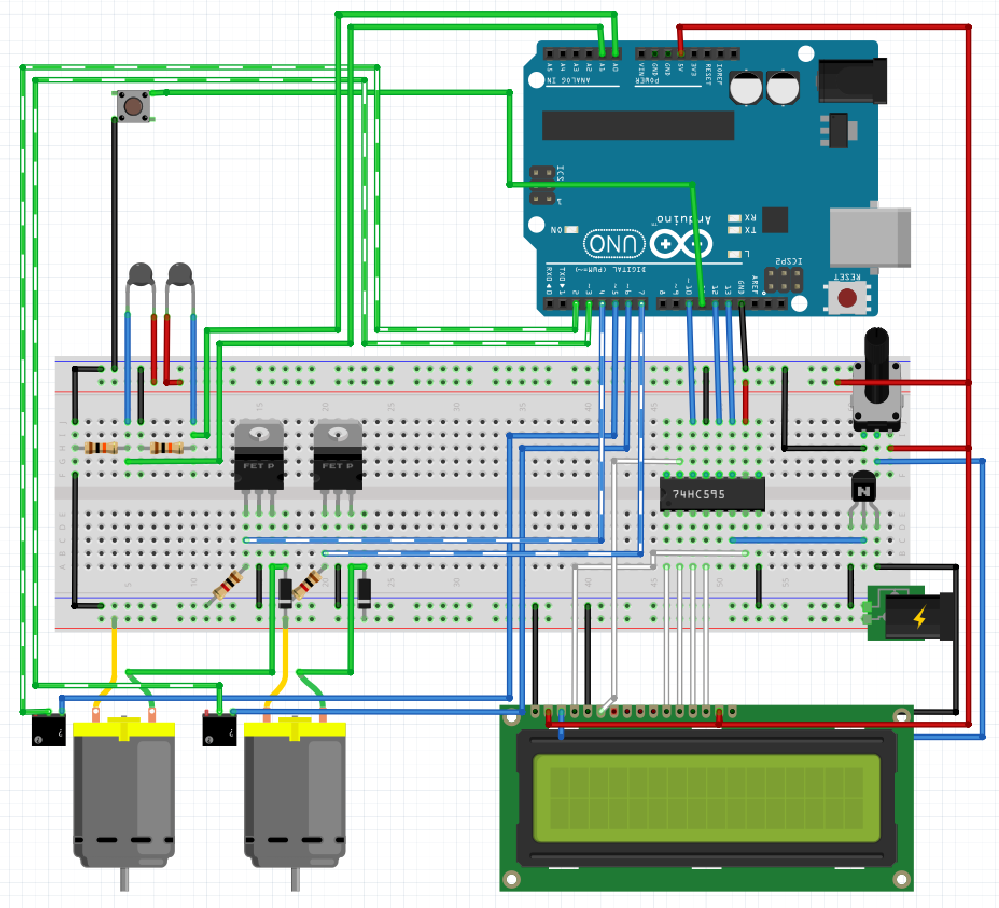

# ArduinoFanController

* [Introduction](#introduction)
* [Requirements](#requirements)
* [Setup](#setup)
* [Development](#development)

# <a name="introduction"></a> Introduction
With the growing popularity of enclosed TV cabinets, as well as the increased power consumption of popular home theater devices such as video game consoles and amplifiers, proper cooling is becoming a problem. 

This program, along with an Arduino Uno and proper equipment, will allow you to cool these cabinets with minimal distraction when you're using your home theater. It can control multiple fans (currently 2) based on the temperature of enclosures in the TV cabinet, adjusting their speed and turning on/off automatically. It also includes support for a 2x16 LCD screen that can display the current status such as fan RPM and temperatures.

A basic knowledge of Arduino development and electronics is required for setup. As explained in the license, this code and guide are provided without warranty and should any damage or injury incur I am not liable. Dealing with electronics can be dangerous and should only be done by those with experience.

# <a name="requirements"></a> Requirements
There is an extensive list of electronics requirements:

* Arduino Uno board or similar
* 2x16 LCD backlit screen (optional, allows observation of status) which requires the following:
  * 10k Potentiometer
  * 595 Shift register (optional to free up Uno pins but code is currently set up to use one)
  * 2222A NPN transistor or similar (required if you want the backlight to turn on/off automatically)
* 12V Power supply that can handle your number of fans (I used 3A for 2 fans)
* 4-pin PWM computer fans of your choice, each one will require:
  * 10k thermistor to monitor temperature
  * IRL540N MOSFET or similar
  * 1k resistor
  * 10k resistor
  * A diode with support for at least 2A
* A momentary pushbutton (optional and allows fans to manually be set to off or full)
* Misc. electronic supplies like wires and a breadboard

For software, the project was created in Visual Studio 2017 (free Community edition is OK) as well as a functional installation of the [Visual Micro](http://www.visualmicro.com/) plugin. It also requires the [LiquidCrystal595](https://codebender.cc/library/LiquidCrystal595#keywords.txt) library to build.

# <a name="setup"></a> Setup
You should already know the basics about an Arduino. Using it in Visual Studio with the Visual Micro plugin is relatively simple, simply load the project's ```fan.sln```, make sure you've set up VM with the Arduino IDE location, selected the proper IDE/board/COM port in the dropdown boxes (IDE should be ```Arduino 1.6/1.8```, board ```Arduino/Genuino Uno```, and the correct COM port will differ). After that all that is required is to hit the run button.

You could also use the official Arduino IDE relatively easily, but I will not provide instruction for that.

You will want to set up the electronics next. Obviously wires will be required, and a prototyping breadboard will make your life a lot easier. Set up like so:



A quick explanation for the connections (this is the case for 2 fans):

* Wire olours are as follows:

 | Colour    | Purpose |
 | --------- | ------- |
 | Black     | Ground  |
 | Red       | +5V (from Arduino 5V pin) |
 | Yellow    | +12V (from Arduino V_in pin) |
 | Green     | Signal input wires |
 | Blue      | Signal output wires |
 | White     | Data pins for the LCD |
 | Dashed    | Used for visuals only |

* The thermistors are setup using voltage dividers with the 10k resistors. One end of each thermistor is on the 5V, the other on the resistor as well as an analog input, and the resistor on the ground.
* The pusbutton is simply connected with one side to ground and the other to a digital input
* The MOSFETS are used to shut off power to the fans when temps are cool. They accept a digital output on the gate pin (which is pulled down to ground using the 1k resistors), connected to ground on their drain pin, and connected to the fans' ground pins on their source. The source also has the diodes connected to the +12V line to prevent backcurrent from breaking the MOSFETs when the fans spin down. 
* The fans are connected with their +12V to the +12V line, ground to the MOSFETs (as mentioned above), TACH/Sense pin to a digital input, and PWM pin to a digital output (the last two are represented as mystery boxes in the layout diagram)
* Instructions on setting up the LCD using the 595 register can be found [here](http://www.instructables.com/id/Hookup-a-16-pin-HD44780-LCD-to-an-Arduino-in-6-sec/)
* The potentiometer is simply used to adjust the contrast of the LCD 
* The power plug is represented as a direct connection to the breadboard here, but in reality you can connect it directly to the Arduino and use the Arduino's Vin pin for 12V supply and the 5V for 5V supply (Arduino has a built in 5V VRM and the low stress here shouldn't be an issue)

The fan pins are as such:


With all this setup, all that's left to do is change the pin constants in ```fan.ino``` to reflect the actual pins you used. There are comments in the code so you know which is which. Note that even if you followed the diagram exactly you will need to change the code since the pins in the digram are different.

After that, run your code and test it out! Holding your finger over a thermistor should be enough to make it activate a fan.

I will be making tweaks to the fan curve over the next couple months, and you can make your own as well. Right now it is a simple linear function that hits 0 at 29C and 100 at 40C. 

# <a name="development"></a> Development
If you've made it this far you're already set up to develop. This section is just to clarify some of the coding:

* ```Cabinet.cpp``` is a class that represents one thermistor/fan combo. Realistically this would be a section of the TV cabinet. It handles the low level updating of inputs/outputs as well as posting data to the LCD and adjusting the fan speed.
* ```TextFormatter.cpp``` contains helper functions to format output for the LCD
* ```Enums.h``` contains enumerations that lower the need for "magic numbers"
* ```fan.ino``` is the main coordinator file that runs the loop

If you find any issues or would like to make improvements I'll review pull requests as often as I can.